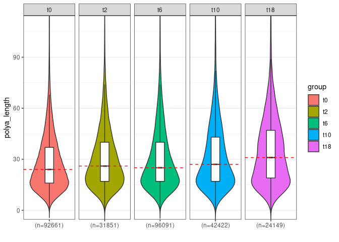

Transcriptome-wide analysis of mRNA adenylation status in yeast using
nanopore sequencing
================
Pawel S Krawczyk Agnieszka Tudek Seweryn Mroczek Andrzej Dziembowski

- <a href="#abstract" id="toc-abstract">Abstract</a>
- <a href="#about-this-dataset" id="toc-about-this-dataset">About this
  dataset</a>
- <a href="#prerequisities" id="toc-prerequisities">Prerequisities</a>
- <a href="#protocol" id="toc-protocol">Protocol</a>
  - <a href="#load-required-libraries" id="toc-load-required-libraries">Load
    required libraries</a>
  - <a href="#load-metadata" id="toc-load-metadata">Load metadata</a>
  - <a href="#load-polya-lengths-data" id="toc-load-polya-lengths-data">Load
    poly(A) lengths data</a>
  - <a href="#basic-qc" id="toc-basic-qc">Basic QC</a>
  - <a href="#data-filtering" id="toc-data-filtering">Data filtering</a>
  - <a href="#polya-lengths-distribution"
    id="toc-polya-lengths-distribution">poly(A) lengths distribution</a>
  - <a href="#statistics" id="toc-statistics">Statistics</a>
  - <a href="#single-transcripts" id="toc-single-transcripts">Single
    transcripts</a>
  - <a href="#per-transcript-summary"
    id="toc-per-transcript-summary">Per-transcript summary</a>
  - <a href="#transcripts-abundance"
    id="toc-transcripts-abundance">Transcripts abundance</a>
- <a href="#further-steps" id="toc-further-steps">Further steps</a>
- <a href="#references" id="toc-references">References</a>

# Abstract

Changes in mRNA poly(A) tail length affect mRNA stability, transport or
translation initiation. Deadenylation is a crucial step of RNA decay and
plays an important role in the adjustment of the transcriptome to
changing growth conditions. There are multiple methods for studying
deadenylation, either in vitro or in vivo, which allow for observation
of either mRNA abundance or poly(A) tail dynamics. However, with direct
RNA sequencing on Oxford Nanopore Technologies (ONT) platform, it is
possible to conduct transcriptome-wide analyses at the single-molecule
level, without the PCR bias introduced by other methods. In this method
chapter, we provide a protocol to measure both RNA levels and
poly(A)-tail lengths in yeast *Saccharomyces cerevisiae* using ONT.

# About this dataset

Steady-state and dynamic measurement of RNA levels and poly(A)-tail
length are the two possible types of experiments in which DRS data can
be used. In this protocol, we focus on dynamic profiles of mRNA
abundance and poly(A)-tail lengths during the response to heat-stress in
a wild-type strain (follow up of<sup>1</sup>, unpublished dataset).

This repository contains data required to proceed with the final part of
the protocol (nanopolish polya<sup>2</sup> output files with poly(A)
lengths for each sample) . They were processed using S. cerevisiae and
S. pombe transcriptomes available from Ensembl
(<https://ftp.ensemblgenomes.org/pub/fungi/release-55/fasta/saccharomyces_cerevisiae/cds/>)
and
<https://ftp.ensemblgenomes.org/pub/fungi/release-55/fasta/schizosaccharomyces_pombe/cds/>,
respectively). Basecalled reads were mapped to the transcriptomes using
Minimap2<sup>3</sup>.

# Prerequisities

It’s assumed that all steps of analysis are run in the Linux
environment. Installation instructions can be found on the documentation
websites for each of the program.

Required R packages:

- nanotail (<https://github.com/LRB-IIMCB/nanotail>)
- tidyverse
- ggplot2
- (optional) tailfindr (<https://github.com/adnaniazi/tailfindr>)

If they are not installed yet, use below commands:

<details open>
<summary>Code</summary>

``` r
install.packages(c("devtools","tidyverse","ggplot2"))
library(devtools)
devtools::install_github("LRB-IIMCB/nanotail")

# optional (if you're going to use tailfindr (not covered in this protocol)):
devtools::install_url('https://cran.r-project.org/src/contrib/Archive/rbokeh/rbokeh_0.5.1.tar.gz', type = "source", dependencies = TRUE)
devtools::install_github("adnaniazi/tailfindr")
```

</details>

# Protocol

Having all reads with called poly(A) lengths, it is possible to continue
with statistical data analysis. As this is direct RNA sequencing, each
read represents a single transcript present in the library. At this
point there are multiple routes of analysis possible, depending on the
experimental setup chosen at the beginning. Here we will cover only the
basic analysis possible with obtained data.

## Load required libraries

This will load all software packages required for processing of data
included in this dataset

<details open>
<summary>Code</summary>

``` r
# load libraries
library(tidyverse)
library(nanotail)
library(ggplot2)
```

</details>

## Load metadata

Load the example metadata tables for both *S. cerevisiae* and *S. pombe*
spike-in data into R session using:

<details open>
<summary>Code</summary>

``` r
metadata <- read.table("metadata_heat.csv",sep=",",header=T)
metadata_pombe <- read.table("metadata_heat_pombe.csv",sep=",",header=T)
```

</details>

<div>

> **Note**
>
> Metadata for multiple samples can be stored in data.frame object, with
> the required columns:
>
> - polya_path (containing the path to nanopolish output file)
> - sample_name.
>
> Additional columns may contain supplementary information describing
> experimental conditions and will be included in the analysis table
> loaded in the next step of the protocol.

</div>

## Load poly(A) lengths data

Data are loaded into single data.frame using read_polya_multiple()
function from the nanotail package, taking metadata table as an
argument.

<details open>
<summary>Code</summary>

``` r
# load data
polya_data_table <- read_polya_multiple(metadata) 

polya_data_table$group <- factor(polya_data_table$group,levels=c("t0","t2","t6","t10","t18"))
polya_data_table_pombe <- read_polya_multiple(metadata_pombe) 
```

</details>

<div>

> **Note**
>
> There is also read_polya_single() function, which loads data from the
> single experiment to the environment.

</div>

## Basic QC

Basic QC can be done using functions included in the nanotail package.
This will summarize data based on the content of qc_tag column of
nanopolish output files.

<div>

> **Note**
>
> Qc_tag column of nanopolish polya output summarizes the reliability of
> poly(A) lengths calculation for each read. Possible categories
> include:
>
> - PASS – read with correct segmentation, reliable calculation of
>   poly(A) length,
> - ADAPTER – the read was stuck for too long at the adapter part, so
>   the read rate estimation, and thus poly(A) length calculation may be
>   unreliable,
> - SUFFCLIP – 3’ terminal part of a read (before poly(A) tail) was not
>   mapped to a reference, so the assignment to reference may be
>   inaccurate,
> - NOREGION – no poly(A) region was found in the raw signal,
> - READ_FAILED_LOAD – there was an issue with reading raw data from
>   fast5 file.

</div>

<details open>
<summary>Code</summary>

``` r
nanopolish_qc <- get_nanopolish_processing_info(polya_data=polya_data_table,grouping_factor = "sample_name") 

#polya_data is the table loaded in point 4. 

# grouping_factor can be any of the metadata columns in the metadata table. Setting to NA will produce a summary of the whole dataset 

plot_nanopolish_qc(nanopolish_processing_info=nanopolish_qc,frequency=F) 
```

</details>


As we can see, a large proportion o reads are assigned to the SUFFCLIP
category. This is due to the reference lacking UTR sequences. As this
should not bias poly(A) length estimations, reads with such a category
can be safely included in the further processed dataset. However,
caution should be taken every time such QC plot shows a large proportion
of categories other than PASS.

<div>

> **Warning**
>
> If there is a large proportion (\>5%) of READ_FAILED_LOAD this means
> there were issues with raw data accessibility. After checking that all
> raw fast5 files are accessible nanopolish analysis should be re-run.

</div>

<div>

> **Warning**
>
> There should not be many NOREGION reads as the library preparation
> protocol selects poly(A)-containing RNAs. Such a category usually
> means that sequencing read was incorrectly processed by the sequencing
> software (MinKNOW) and should be discarded from the analysis.

</div>

<div>

> **Warning**
>
> A large proportion of ADAPTER reads means that there are problems with
> the sequencing itself and, even if such reads could be considered for
> further analysis it is advisable to rerun the sequencing of such
> samples.

</div>

## Data filtering

In the next step, reads which failed internal nanopolish QC (assigned to
categories NOREGION, READ_FAILED_PASS, or ADAPTER) can be removed. It
can be done using dplyr package:

<details open>
<summary>Code</summary>

``` r
polya_data_filtered <- polya_data_table %>% dplyr::filter(qc_tag %in% c("PASS","SUFFCLIP")) 
```

</details>

<div>

> **Note**
>
> SUFFCLIP reads were included as we expect them based on the reference
> transcriptome. However, in most cases only PASS reads should be
> included in the filtered dataset.

</div>

## poly(A) lengths distribution

Next, we can show global distribution of poly(A) tail lengths on a
density plot using plot_polya_distribution() function:

<details open>
<summary>Code</summary>

``` r
plot_polya_distribution(polya_data=polya_data_filtered, groupingFactor="group",show_center_value="median")
```

</details>


<div>

> **Note**
>
> If spike-ins were added to the library, their poly(A) distributions
> should also be examined to identify any technical issues that can bias
> the DRS output. Samples for which *S. pombe* (or other spike-in)
> poly(A)-tail lengths strongly diverge should be discarded.

</div>

For multiple samples, it is better to use a violin plot instead”

<details open>
<summary>Code</summary>

``` r
plot_polya_violin(polya_data = polya_data_filtered,groupingFactor = "group",add_boxplot=T,transcript_id=NULL)  
```

</details>



## Statistics

Next, find transcripts with significant change in poly(A) lengths
between conditions using kruskal_polya() function (from the nanotail
package). It uses Kruskall-Wallis test for comparison between multiple
groups.

<div>

> **Note**
>
> Computation of statistics can take several minutes to finish

</div>

<details open>
<summary>Code</summary>

``` r
polya_data_stats<-kruskal_polya(input_data=polya_data_filtered,grouping_factor="group",transcript_id="transcript") 
```

</details>

<div>

> **Tip**
>
> The result table can be reviewed with the command:
>
>     View(polya_data_stats %>% dplyr::filter(padj<0.05)) 

</div>

Number of transcripts showing a significant change in poly(A) lengths
can be assessed with:

<details open>
<summary>Code</summary>

``` r
polya_data_stats %>% dplyr::filter(padj<0.05) %>% count() 
```

</details>

|   n |
|----:|
| 150 |

## Single transcripts

Poly(A) lengths for individual transcripts can be viewed using
plot_polya_distribution() or plot_polya_violin() functions, similar to
global distribution.

The transcript identifier can be specified with “transcript_id” argument
and may contain multiple transcript ids in form of vector.

Example for YMR251W-A_mRNA transcript, which is the most significant hit
from statistical analysis performed in a previous step:

<details open>
<summary>Code</summary>

``` r
plot_polya_violin(polya_data = polya_data_filtered,groupingFactor = "group",transcript_id="YMR251W-A_mRNA")  
```

</details>


## Per-transcript summary

Next, calculate the per-transcript summary of poly(A) length
distributions. This will produce mean, median, and quantile
(0.03,0.05,0.95,0.97) values for each transcript at each condition. Such
numeric values can nicely show changes in poly(A) length between
analyzed conditions as they represent poly(A) length dynamics with
better sensitivity than just looking at mean or median values.

<details open>
<summary>Code</summary>

``` r
polya_summary <- summarize_polya_per_transcript(polya_data = polya_data_filtered,groupBy="group",transcript_id="transcript",quantiles=c(0.03,0.05,0.95,0.97),summary_functions=c("mean","median"))
```

</details>

<div>

> **Note**
>
> Most yeast cellular poly(A)-tail profiles are normal with the mean and
> median located between 20 and 40 adenosines. Since from other studies
> we know that the newly made poly(A)-tail length is around 50-60
> adenosines with the upper adenylation limit of 200<sup>1,4</sup>, the
> mean and median values most likely represent RNAs deadenylated in the
> cytoplasm.
>
> Distribution of yeast poly(A)-tail quantiles values will range between
> 50-60 for the upper quantiles (e.g. 75-99th), and as follows those
> values will represent newly-made mRNAs, which might be nuclear or
> freshly exported to the cytoplasm. The 50th and neighboring quantiles
> will be similar to the mean and median, while the lower quantiles
> 5-20th will represent old and strongly deadenylated mRNAs, for which
> the poly(A)-tail lengths will be close to the DRS detection limit
> (around 5-10 adenosines).
>
> We routinely examine quantiles: 0.05, 0.10, 0.15, 0.50, 0.75, 0.80,
> 0.85, 0.90, and 0.95.

</div>

Obtained values can be plotted to show changes in selected transcripts.
Quantiles distribution can be plotted with function plot_quantiles()

<details open>
<summary>Code</summary>

``` r
plot_quantiles(summarized_data=polya_summary,transcript_id= "YMR251W-A_mRNA",groupBy="group") 
```

</details>


## Transcripts abundance

To look at transcripts abundance it is necessary to normalize counts to
sequencing depth (and to *S. Pombe* spike-in, if was used). For this
purpose please use:

<details open>
<summary>Code</summary>

``` r
polya_summary_normalized <- normalize_counts_to_depth(summarized_data=polya_summary,raw_data=polya_data_table,spike_in_data=polya_data_table_pombe,groupBy="group")
```

</details>

    # A tibble: 5 × 3
      group      n norm_factor
      <fct>  <int>       <dbl>
    1 t0    123083        3.92
    2 t2     45217        1.44
    3 t6    130211        4.15
    4 t10    59062        1.88
    5 t18    31365        1   

This will produce a separate table containing norm_counts column with
normalized expression values. Obtained data can be used to analyze the
relationship between transcript abundance and poly(A) lengths, and their
dynamics.

<div>

> **Tip**
>
> Another option is to use genome-mapped reads, counted with other tools
> (like featureCounts), import counts to R, and normalize using software
> packages devoided for expression analysis (like DESeq2 or EdgeR).

</div>

# Further steps

All obtained values can be useful for data interpretation but can only
be used if the appropriate number of reads is provided for each
transcript.

<div>

> **Tip**
>
> We propose that such a cut-off should be at least 10 reads for mean
> and median values and 20 reads for mode and quantile values.

</div>

Many solid conclusions can be driven when analyzing changes in mean and
median values. The mean will be more sensitive to extremely long
poly(A)-tails and can show more differences between strains or
conditions, that are however more solid if also seen in median values.
Budding yeast is an exceptional species that does not contain
cytoplasmic adenylases. This means that the poly(A)-tail can only be
shortened or remain stable. In principle, this allows for the modeling
of deadenylation rates by comparing changes to either the mean/medians
or the quantile values. As in the case of decay rates, this can be done
by fitting function parameters into experimental data, as proposed for
decay previously<sup>5,6</sup>.

The advantage of DRS is that this method simultaneously provides
information about mRNA levels and poly(A)-tail lengths. We suggested the
use of the *S. pombe* spike-in because it can be used at the step of RNA
enrichment by oligo-dT to provide a normalization also for the DRS
datasets. The spike-in will also be useful to control for substantial
down- or up-regulation of certain transcripts. Simultaneous comparison
of changes in mean/median poly(A)-tail lengths and fold-change in RNA
abundance can help to interpret the data. For example, a strong decrease
in poly(A)-tail length coupled with a decrease in mRNA abundance is
indicative of transcript decay. Conversely increase in both factors
could suggest increased RNA stability or de novo transcription.

# References

<div id="refs" class="references csl-bib-body" line-spacing="2">

<div id="ref-Tudek2021" class="csl-entry">

<span class="csl-left-margin">1. </span><span
class="csl-right-inline">Tudek, A. *et al.* [Global view on the
metabolism of RNA poly(A) tails in yeast Saccharomyces
cerevisiae](https://doi.org/10.1038/s41467-021-25251-w). *Nature
Communications* **12**, (2021).</span>

</div>

<div id="ref-Workman2019" class="csl-entry">

<span class="csl-left-margin">2. </span><span
class="csl-right-inline">Workman, R. E. *et al.* [Nanopore native RNA
sequencing of a human poly(A)
transcriptome](https://doi.org/10.1038/s41592-019-0617-2). *Nature
Methods* **16**, 1297–1305 (2019).</span>

</div>

<div id="ref-Li2018" class="csl-entry">

<span class="csl-left-margin">3. </span><span
class="csl-right-inline">Li, H. [Minimap2: pairwise alignment for
nucleotide sequences](https://doi.org/10.1093/bioinformatics/bty191).
*Bioinformatics* **34**, 3094–3100 (2018).</span>

</div>

<div id="ref-Turtola2021" class="csl-entry">

<span class="csl-left-margin">4. </span><span
class="csl-right-inline">Turtola, M. *et al.* [Three-layered control of
mRNA poly(A) tail synthesis in *Saccharomyces
cerevisiae*](https://doi.org/10.1101/gad.348634.121). *Genes &
Development* **35**, 1290–1303 (2021).</span>

</div>

<div id="ref-Miller2011" class="csl-entry">

<span class="csl-left-margin">5. </span><span
class="csl-right-inline">Miller, C. *et al.* [Dynamic transcriptome
analysis measures rates of mRNA synthesis and decay in
yeast](https://doi.org/10.1038/msb.2010.112). *Molecular Systems
Biology* **7**, 458 (2011).</span>

</div>

<div id="ref-Alexander2010" class="csl-entry">

<span class="csl-left-margin">6. </span><span
class="csl-right-inline">Alexander, R. D. *et al.* [RiboSys, a
high-resolution, quantitative approach to measure the in vivo kinetics
of pre-mRNA splicing and 3’-end processing in *Saccharomyces
cerevisiae*](https://doi.org/10.1261/rna.2162610). *RNA* **16**,
2570–2580 (2010).</span>

</div>

</div>
